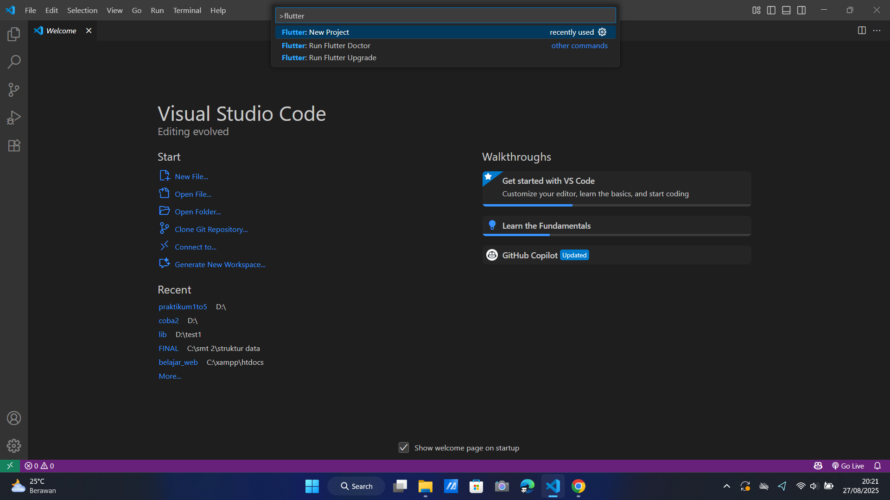
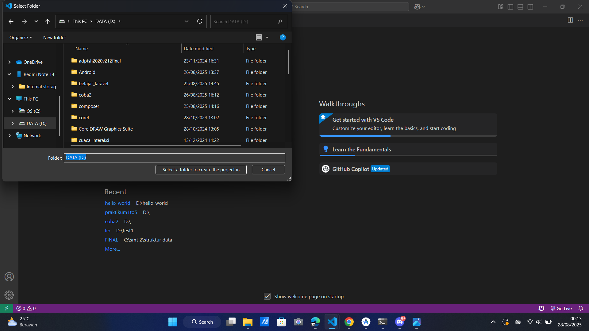
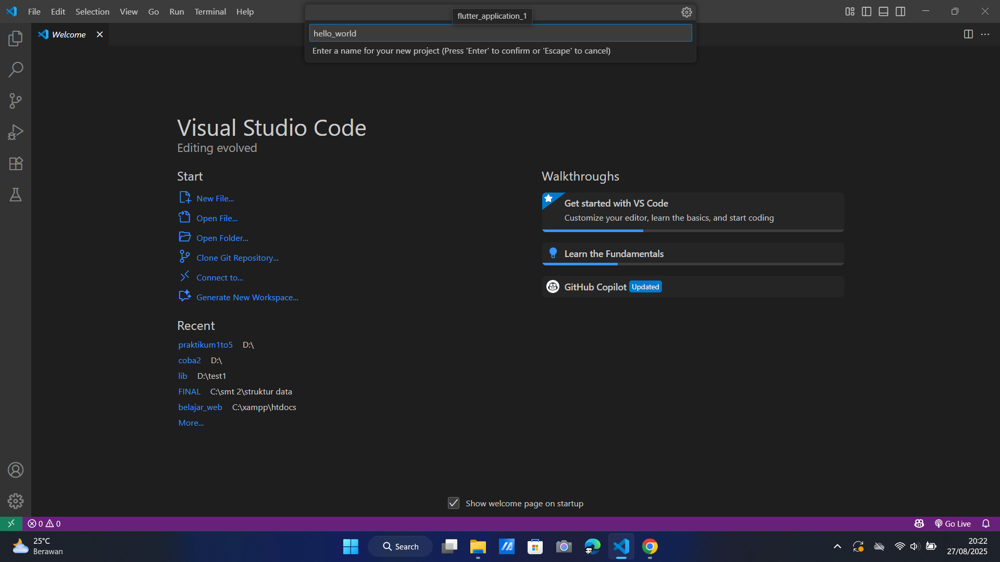
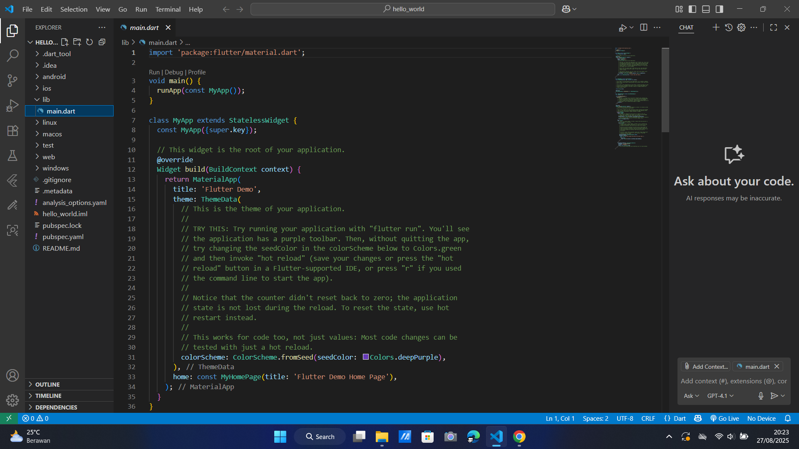
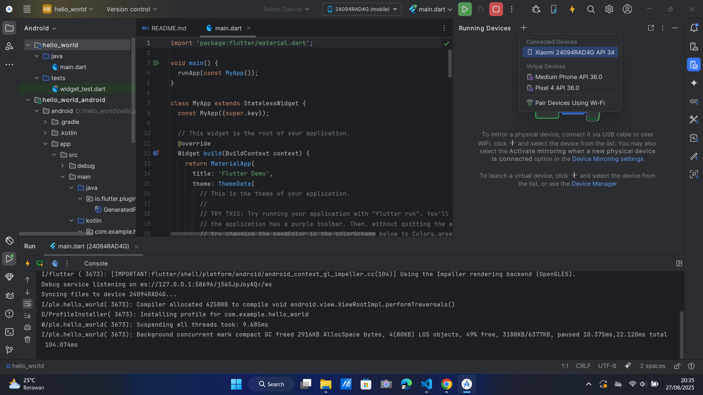
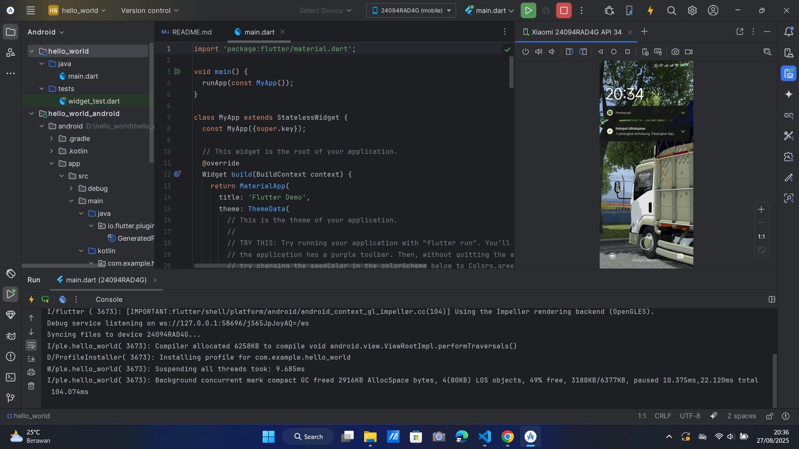
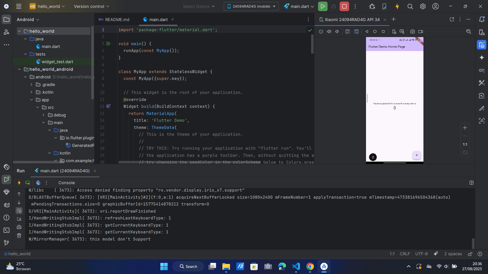
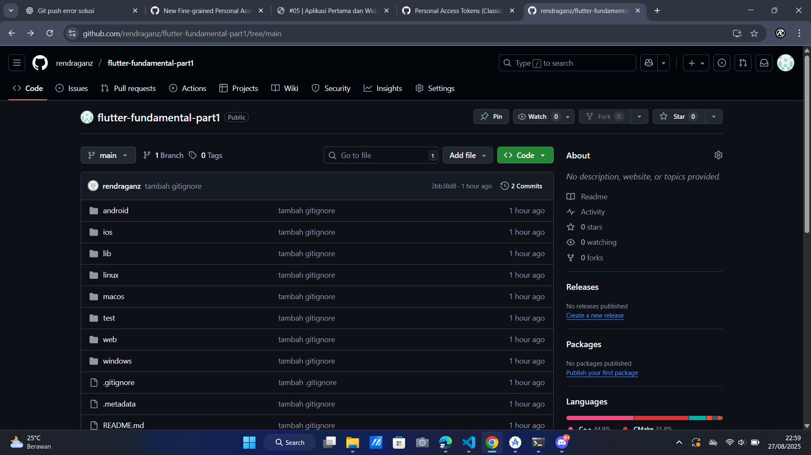

# hello_world

A new Flutter project.

# PRAKTIKUM 1: Membuat Project Flutter Baru

Langkah 1:
Buka VS Code, lalu tekan tombol Ctrl + Shift + P maka akan tampil Command Palette, lalu ketik Flutter. Pilih New Project.

Langkah 2:
Kemudian buat folder sesuai style laporan praktikum yang Anda pilih. Disarankan pada folder dokumen atau desktop atau alamat folder lain yang tidak terlalu dalam atau panjang. Lalu pilih Select.

Langkah 3:
Buat nama project flutter hello_world seperti berikut, lalu tekan Enter. Tunggu hingga proses pembuatan project baru selesai.

Langkah 4:
Jika sudah selesai proses pembuatan project baru, pastikan tampilan seperti berikut. Artinya Anda telah berhasil membuat project Flutter baru.

# PRAKTIKUM 2: Menghubungkan Perangkat Android atau Emulator

Screenshot hasil menghubungkan perangkat android menggunakan mirroring dengan android studio:

Memilih perangkat android yang dipakai.

Tampilan saat tersambung.

Tampilan saat membuka aplikasi project flutternya.

# PRAKTIKUM 3: Membuat Repository GitHub dan Laporan Praktikum

Screenshot praktik membuat repository GitHub

