# hello_world

A new Flutter project.

# PRAKTIKUM 1: Membuat Project Flutter Baru

Langkah 1:
Buka VS Code, lalu tekan tombol Ctrl + Shift + P maka akan tampil Command Palette, lalu ketik Flutter. Pilih New Project.

Langkah 2:
Kemudian buat folder sesuai style laporan praktikum yang Anda pilih. Disarankan pada folder dokumen atau desktop atau alamat folder lain yang tidak terlalu dalam atau panjang. Lalu pilih Select.

Langkah 3:
Buat nama project flutter hello_world seperti berikut, lalu tekan Enter. Tunggu hingga proses pembuatan project baru selesai.

Langkah 4:
Jika sudah selesai proses pembuatan project baru, pastikan tampilan seperti berikut. Artinya Anda telah berhasil membuat project Flutter baru.

# PRAKTIKUM 2: Menghubungkan Perangkat Android atau Emulator

Screenshot hasil menghubungkan perangkat android menggunakan mirroring dengan android studio:

Memilih perangkat android yang dipakai.

Tampilan saat tersambung.

Tampilan saat membuka aplikasi project flutternya.

# PRAKTIKUM 3: Membuat Repository GitHub dan Laporan Praktikum

Screenshot praktik membuat repository GitHub

# PRAKTIKUM 4: Menerapkan Widget Dasar

Text widget

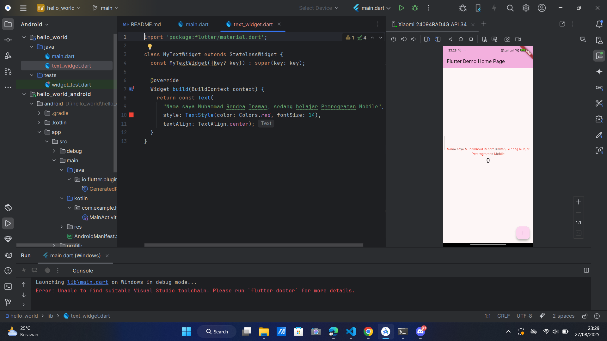

Image Widget

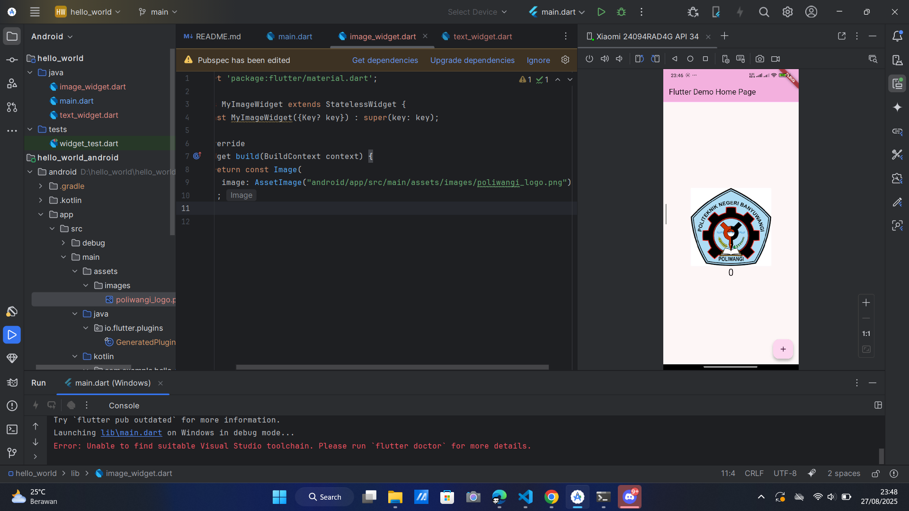

# PRAKTIKUM 5: Menerapkan Widget Material Design dan iOS Cupertino

Langkah 1: Cupertino Button dan Loading Bar
Buat file di basic_widgets > loading_cupertino.dart. Import stateless widget dari material dan cupertino. Lalu isi kode di dalam method Widget build adalah sebagai berikut.

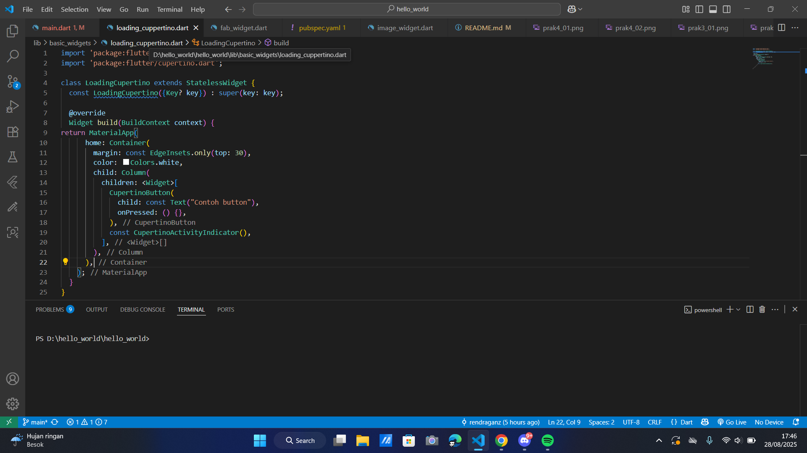

Langkah 2: Floating Action Button (FAB)
Button widget terdapat beberapa macam pada flutter yaitu ButtonBar, DropdownButton, TextButton, FloatingActionButton, IconButton, OutlineButton, PopupMenuButton, dan ElevatedButton.

Buat file di basic_widgets > fab_widget.dart. Import stateless widget dari material. Lalu isi kode di dalam method Widget build adalah sebagai berikut.

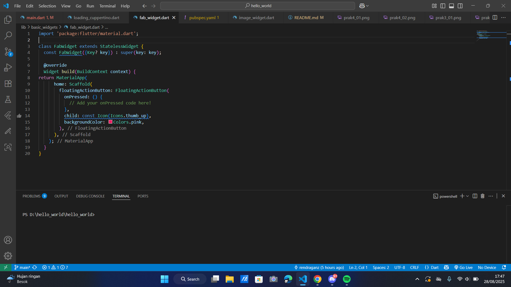

Langkah 3: Scaffold Widget
Scaffold widget digunakan untuk mengatur tata letak sesuai dengan material design.

Ubah isi kode main.dart seperti berikut.

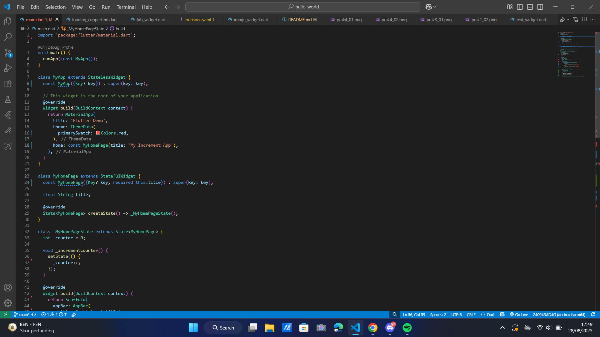
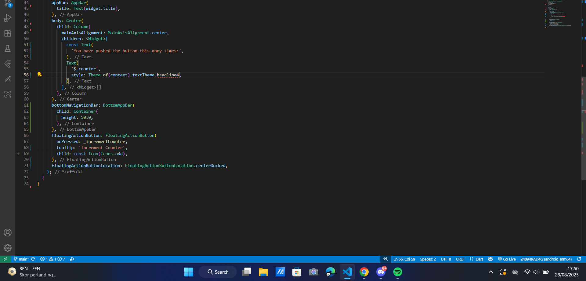

Langkah 4: Dialog Widget
Dialog widget pada flutter memiliki dua jenis dialog yaitu AlertDialog dan SimpleDialog.

Ubah isi kode main.dart seperti berikut.

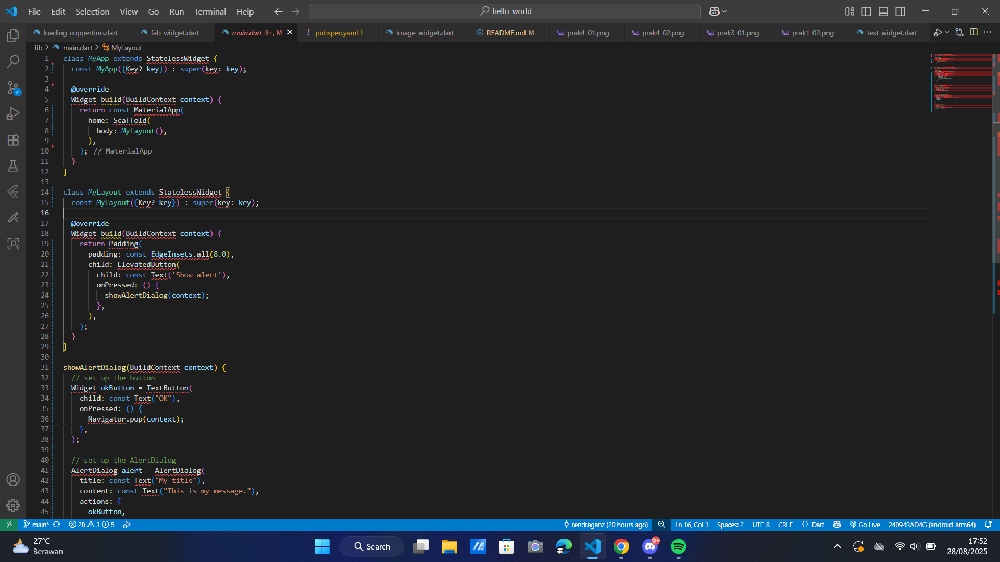
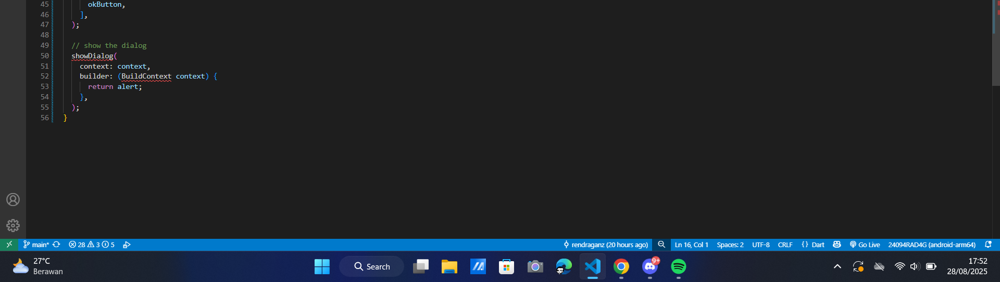

Langkah 5: Input dan Selection Widget
Flutter menyediakan widget yang dapat menerima input dari pengguna aplikasi yaitu antara lain Checkbox, Date and Time Pickers, Radio Button, Slider, Switch, TextField.

Contoh penggunaan TextField widget adalah sebagai berikut:

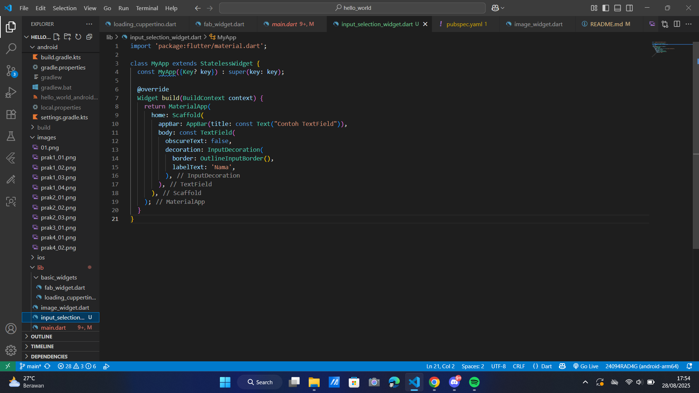

Langkah 6: Date and Time Pickers
Date and Time Pickers termasuk pada kategori input dan selection widget, berikut adalah contoh penggunaan Date and Time Pickers.

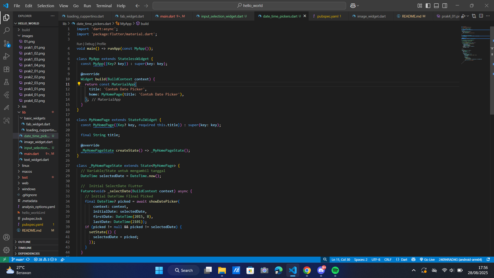
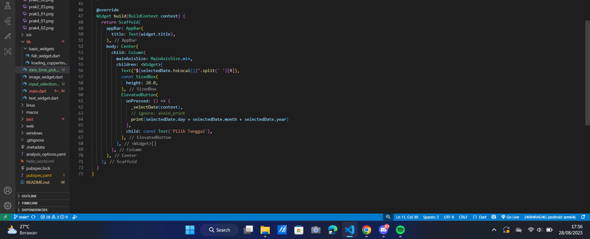